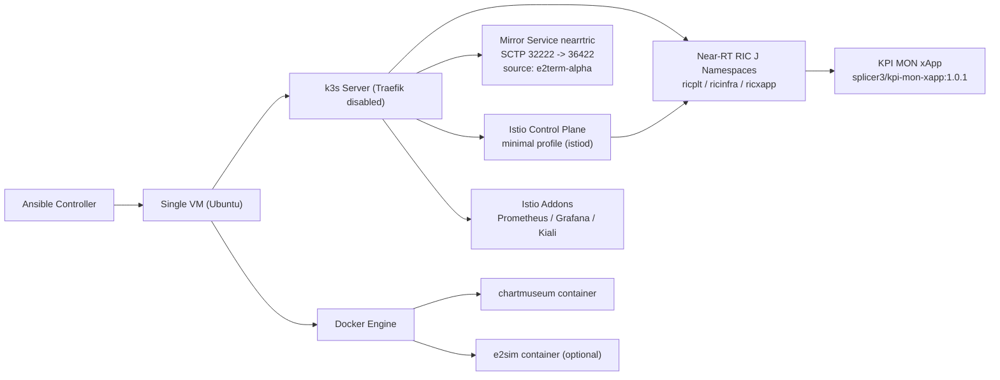
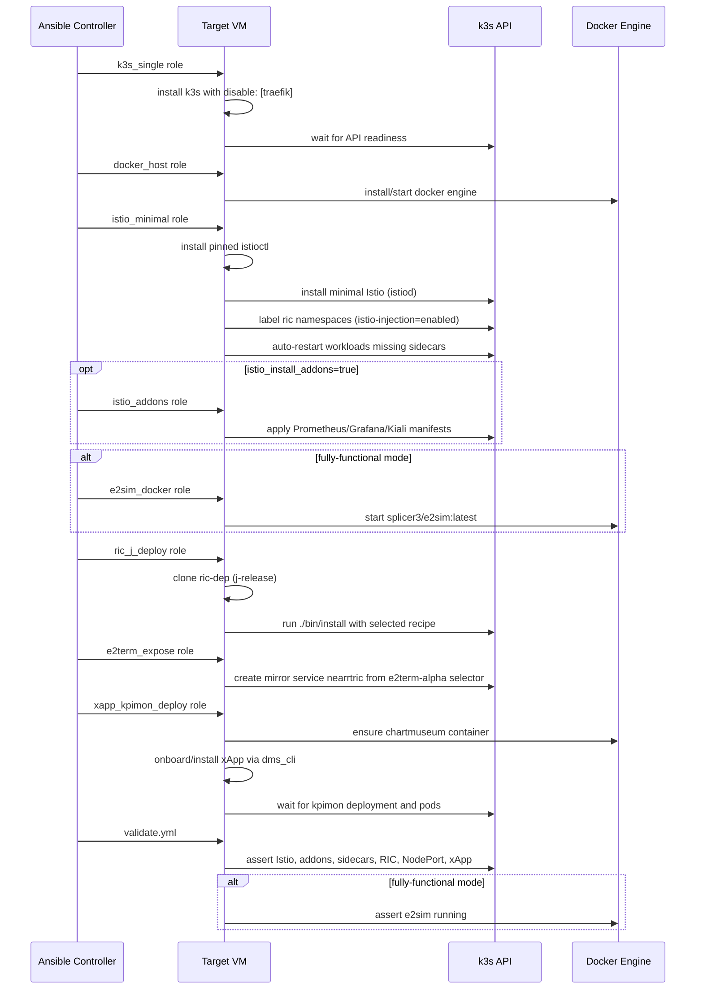

# Architecture

The Mermaid diagrams are architecture sketches; rendering depends on the Markdown viewer.

## Component View

```mermaid
graph LR
    A["Ansible Controller"] --> B["Single VM (Ubuntu)"]
    B --> C["k3s Server (Traefik disabled)"]
    C --> D["Near-RT RIC J Namespaces\nricplt / ricinfra / ricxapp"]
    C --> E["Mirror Service nearrtric\nSCTP 32222 -> 36422\nsource: e2term-alpha"]
    C --> F["Istio Control Plane\nminimal profile (istiod)"]
    C --> G["Istio Addons\nPrometheus / Grafana / Kiali"]
    B --> H["Docker Engine"]
    H --> I["chartmuseum container"]
    H --> J["e2sim container (optional)"]
    D --> K["KPI MON xApp\nsplicer3/kpi-mon-xapp:1.0.1"]
    F --> D
```

## Deployment Sequence

```mermaid
sequenceDiagram
    participant Ctrl as Ansible Controller
    participant VM as Target VM
    participant K3s as k3s API
    participant Docker as Docker Engine

    Ctrl->>VM: k3s_single role
    VM->>VM: install k3s with disable: [traefik]
    VM->>K3s: wait for API readiness

    Ctrl->>VM: docker_host role
    VM->>Docker: install/start docker engine

    Ctrl->>VM: istio_minimal role
    VM->>VM: install pinned istioctl
    VM->>K3s: install minimal Istio (istiod)
    VM->>K3s: label ric namespaces (istio-injection=enabled)
    VM->>K3s: auto-restart workloads missing sidecars

    opt istio_install_addons=true
        Ctrl->>VM: istio_addons role
        VM->>K3s: apply Prometheus/Grafana/Kiali manifests
    end

    alt fully-functional mode
        Ctrl->>VM: e2sim_docker role
        VM->>Docker: start splicer3/e2sim:latest
    end

    Ctrl->>VM: ric_j_deploy role
    VM->>VM: clone ric-dep (j-release)
    VM->>K3s: run ./bin/install with selected recipe

    Ctrl->>VM: e2term_expose role
    VM->>K3s: create mirror service nearrtric from e2term-alpha selector

    Ctrl->>VM: xapp_kpimon_deploy role
    VM->>Docker: ensure chartmuseum container
    VM->>VM: onboard/install xApp via dms_cli
    VM->>K3s: wait for kpimon deployment and pods

    Ctrl->>VM: validate.yml
    VM->>K3s: assert Istio, addons, sidecars, RIC, NodePort, xApp
    alt fully-functional mode
        VM->>Docker: assert e2sim running
    end
```
