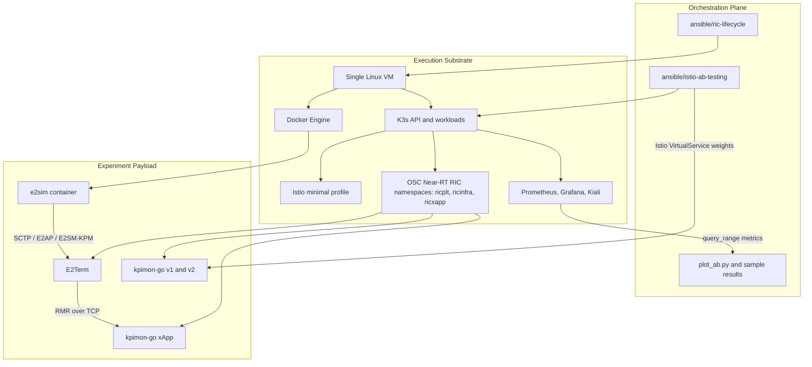

# Architecture

This repository describes a single-VM O-RAN Near-RT RIC lab for xApp lifecycle automation and traffic-switching experiments. The system has three main planes:

- **Orchestration Plane**: Ansible playbooks, roles, templates, validation tasks, and local result-processing scripts.
- **Execution Substrate**: the Linux VM, K3s, Docker, Istio, RIC platform namespaces, and observability services that host the lab.
- **Experiment Payload**: `kpimon-go`, e2sim, E2SM-KPM report traffic, and the Time-Based Switching workflow.

## Three-Plane View

## Plane Responsibilities

| Plane | Important paths | Responsibility |
| --- | --- | --- |
| Orchestration Plane | `ansible/ric-lifecycle/site.yml`, `ansible/ric-lifecycle/roles/**`, `ansible/istio-ab-testing/playbooks/**` | Installs the lab, applies Kubernetes and Istio resources, starts optional e2sim, onboards `kpimon-go`, validates the stack, flips traffic, and collects metrics. |
| Execution Substrate | `ansible/ric-lifecycle/group_vars/all.yml`, role templates under `ansible/ric-lifecycle/roles/**` | Provides the single-VM runtime: K3s, Docker, Helm, ChartMuseum containers, RIC platform namespaces, Istio sidecars, and observability addons. |
| Experiment Payload | `ansible/ric-lifecycle/roles/e2sim_docker`, `ansible/ric-lifecycle/roles/xapp_kpimon_deploy`, `ansible/istio-ab-testing/roles/istio_traffic` | Generates sustained E2SM-KPM traffic, deploys `kpimon-go`, creates A/B xApp variants, and records switching behavior through Prometheus metrics. |

## Component Fit

`ansible/ric-lifecycle/site.yml` is the main deployment path. Its role order is:

1. `k3s_single`
2. `docker_host`
3. `istio_minimal` when `istio_enabled` is true
4. `istio_addons` when `istio_install_addons` is true
5. `ric_j_deploy`
6. `e2term_expose` when `ric_e2term_expose_enabled` is true
7. `e2sim_docker` when `e2sim_mode` is `fully-functional`
8. `xapp_kpimon_deploy`
9. `playbooks/validate.yml`

K3s is installed as the Kubernetes runtime on the target VM with Traefik disabled. Docker is installed separately because the lab runs support containers such as ChartMuseum and, in `fully-functional` mode, the e2sim container.

The Near-RT RIC deployment is driven through the upstream `ric-plt-ric-dep` repository at the configured release branch. The automation prepares Helm and a local ChartMuseum endpoint for `ric-common`, runs the selected RIC recipe, waits for the RIC namespaces, and then onboards `kpimon-go` through the RIC xApp tooling.

Istio is installed with the minimal profile. The automation labels `ricplt`, `ricinfra`, and `ricxapp` for sidecar injection and restarts existing workloads that are missing sidecars. When enabled, the addon role applies Istio sample manifests for Prometheus, Grafana, and Kiali.

The Time-Based Switching workflow in `ansible/istio-ab-testing` prepares two `kpimon-go` deployments, applies a `DestinationRule`, and updates a `VirtualService` for the RMR service host `service-ricxapp-kpimon-go-rmr.ricxapp.svc.cluster.local`. The default TCP ports are `4560` for RMR data and `4561` for RMR routing.

## Main Flows

### Provisioning Control Flow

The Ansible controller reaches the target VM over SSH. Tasks install system packages, bootstrap K3s, copy the target kubeconfig to the remote user's home with mode `0600`, interact with the K3s API, manage Docker containers, clone upstream RIC repositories, and run validation checks.

### RIC And xApp Control Flow

`ric_j_deploy` installs the RIC platform into the configured namespaces. `xapp_kpimon_deploy` renders the `kpimon-go` descriptor and schema, ensures a ChartMuseum endpoint is available, installs `dms_cli` from `ric-plt-appmgr`, downloads the xApp Helm chart, and waits for the resulting xApp deployment.

### E2 And KPI Flow

In `fully-functional` mode, `e2sim_docker` starts the configured e2sim image with host networking and environment variables such as `RAN_FUNC_ID`, `REPORTS_RESTART_SLEEP_MS`, and `REPORTS_SEND_GAP_MS`. The simulator sends E2AP/E2SM-KPM traffic over SCTP toward E2Term. If `ric_e2term_expose_enabled` is true, the lab creates an SCTP NodePort service named by `ric_e2term_nodeport_service_name`; the default mapping is NodePort `32222` to target port `36422`.

After E2Term receives E2 traffic, KPI messages relevant to `kpimon-go` move inside the RIC/xApp environment through RMR over TCP. The `kpimon-go` descriptor declares RMR on `tcp:4560`; port `4560` is used for RMR data and port `4561` is used for RMR route traffic.

### Time-Based Switching Flow

The A/B workflow scales or prepares `kpimon-go` variants with `version` labels `v1` and `v2`. It alternates the Istio `VirtualService` between `100/0` and `0/100` TCP routing weights for the configured number of cycles. After the run, it queries Prometheus with `query_range` for `istio_tcp_received_bytes_total`, grouped by `destination_version`, and renders CSV/HTML outputs with `ansible/istio-ab-testing/scripts/plot_ab.py`.

## Traffic And Observability Boundaries

| Traffic | Where it appears | Observable through Istio sidecars? | Notes |
| --- | --- | --- | --- |
| E2 SCTP | e2sim container to E2Term, optionally through the `sctp-service` NodePort | No | Envoy sidecars do not provide native SCTP telemetry in this lab. Use separate SCTP-aware tooling for packet-level inspection. Packet captures are not part of the public repository. |
| RMR/TCP | `kpimon-go` service traffic on ports `4560` and `4561` in `ricxapp` | Yes, when the relevant pods are sidecar-injected and traffic passes through Envoy | This is the traffic used by the A/B switching experiment and Prometheus query. |
| xApp HTTP health | `kpimon-go` container port `8080` | Partly, depending on sidecar injection and traffic path | The descriptor includes HTTP liveness and readiness probes. |
| Kubernetes control traffic | Ansible, K3s API, Helm, and RIC install scripts | Not the focus of Istio telemetry | This is provisioning and validation traffic, not experiment payload traffic. |

Prometheus, Grafana, and Kiali are useful for sidecar-observed TCP service behavior, workload health, and mesh topology. They do not make SCTP/E2AP payloads visible, and they do not replace RIC-specific or SCTP-specific debugging tools. For operational checks, see [observability.md](observability.md) and [troubleshooting.md](troubleshooting.md).

## Known Constraints

- The public lab targets a single VM. It does not model a multi-node or high-availability RIC deployment.
- E2 SCTP traffic is outside Istio's native sidecar telemetry in this repository.
- Time-Based Switching measurements are affected by Envoy configuration propagation, workload readiness, Prometheus scrape interval, and query window settings.
- The default `e2sim_image` is configured as `splicer3/e2sim:latest`; pin the image before using the lab for repeatable comparisons.
- e2sim provides controllable E2SM-KPM traffic for this lab. It does not replace a full RAN or OAI-gNB integration path.
- Kubeconfigs, packet captures, large logs, private inventories, and personal thesis material are intentionally excluded from the public repository.
